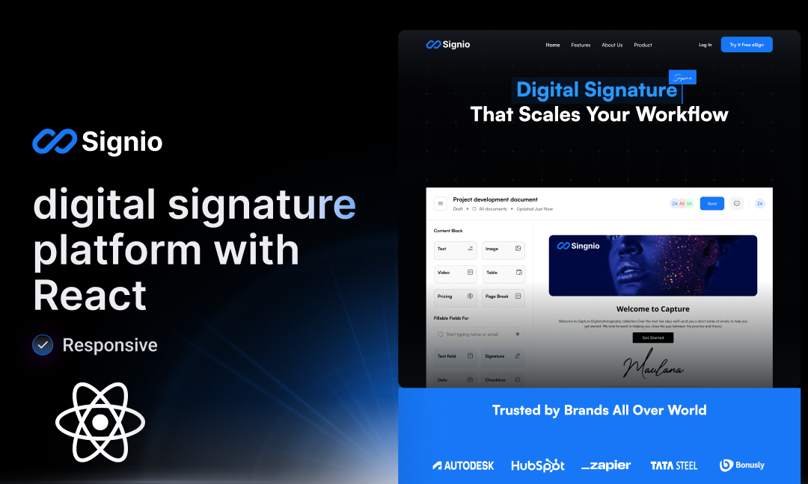

# Signio
<p align="center">
  
</p>

🖋️ **A modern, secure digital signature platform that scales your workflow**

Signio is a comprehensive e-signature solution built with React that enables businesses to create, send, and manage digital documents with legally binding electronic signatures. From individual users to enterprise teams, Signio streamlines document workflows across any device.

## 🌟 Live Demo

**[View Live Application →](https://mxd0-0.github.io/signio/)**

## 🛠️ Tech Stack

- **Frontend**: React 19 with modern hooks and functional components
- **Build Tool**: Vite 7 for fast development and optimized production builds
- **Styling**: Tailwind CSS 4 with custom design system
- **Animations**: Framer Motion for smooth, performant animations
- **Code Quality**: ESLint with React-specific rules
- **Deployment**: GitHub Pages with automated CI/CD

## 🚀 Quick Start

### Prerequisites
- Node.js 18+
- npm or yarn package manager

### Installation

1. **Clone the repository**
   ```bash
   git clone https://github.com/mxd0-0/signio.git
   cd signio
   ```

2. **Install dependencies**
   ```bash
   npm install
   ```

3. **Start development server**
   ```bash
   npm run dev
   ```

   The application will be available at `http://localhost:5173`

### Available Scripts

| Command | Description |
|---------|-------------|
| `npm run dev` | Start development server with hot reload |
| `npm run build` | Build for production |
| `npm run preview` | Preview production build locally |
| `npm run lint` | Run ESLint code analysis |
| `npm run deploy` | Deploy to GitHub Pages |
| `npm run test:deployment` | Test GitHub Pages deployment readiness |
| `npm run validate:deployment` | Validate deployment configuration |

## 🏗️ Project Structure

```
signio/
├── src/
│   ├── components/          # Reusable UI components
│   │   ├── Button.jsx       # Custom button component
│   │   └── BrandLogo.jsx    # Brand logo component
│   ├── sections/            # Page sections
│   │   ├── Hero.jsx         # Landing page hero
│   │   ├── Features.jsx     # Features showcase
│   │   ├── Pricing.jsx      # Pricing plans
│   │   ├── Advantages.jsx   # Key advantages
│   │   ├── LogoCloud.jsx    # Trusted brands
│   │   ├── CTA.jsx          # Call-to-action
│   │   └── Footer.jsx       # Site footer
│   ├── assets/              # Static assets (images, icons)
│   ├── index.css           # Global styles and Tailwind config
│   ├── App.jsx             # Main application component
│   └── main.jsx            # Application entry point
├── scripts/                 # Deployment and testing scripts
├── public/                  # Public assets
└── dist/                   # Production build output
```
## 📄 License

This project is part of a portfolio demonstration. Please check with the repository owner for usage rights.

---

**Built with ❤️ using React, Vite, and Tailwind CSS**
